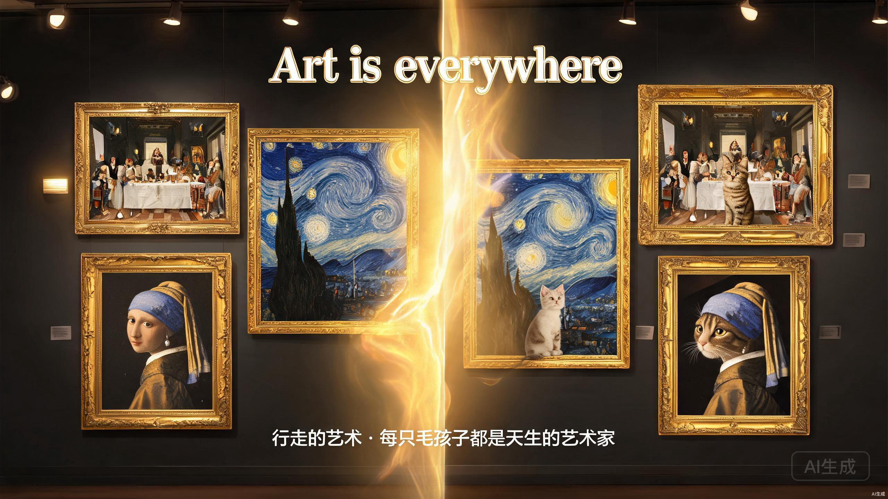
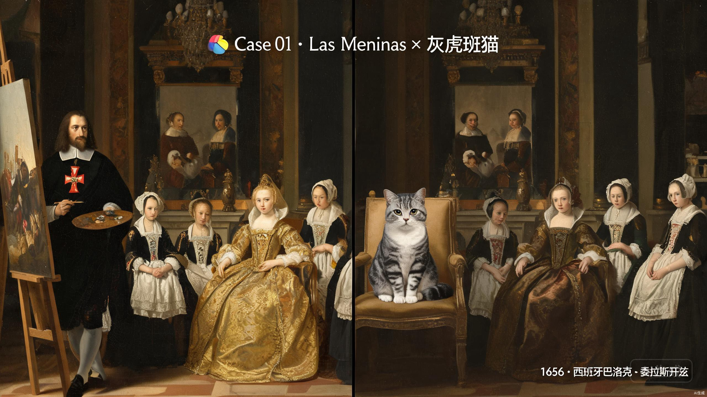
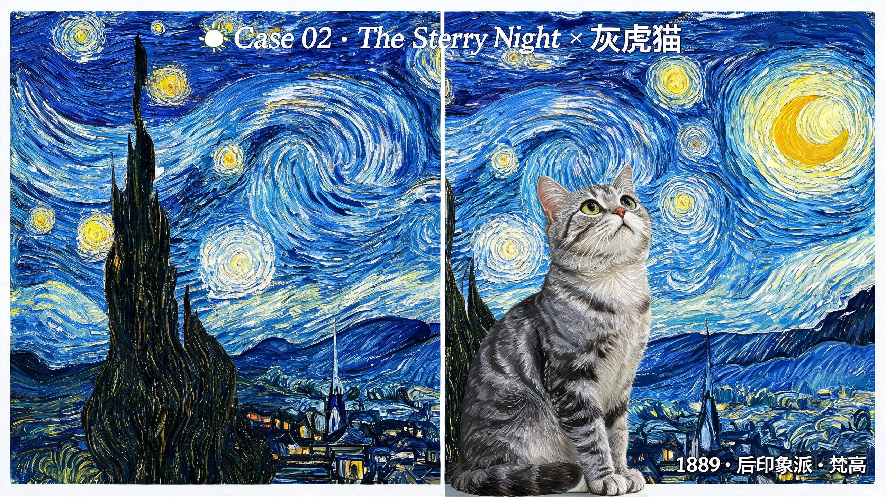
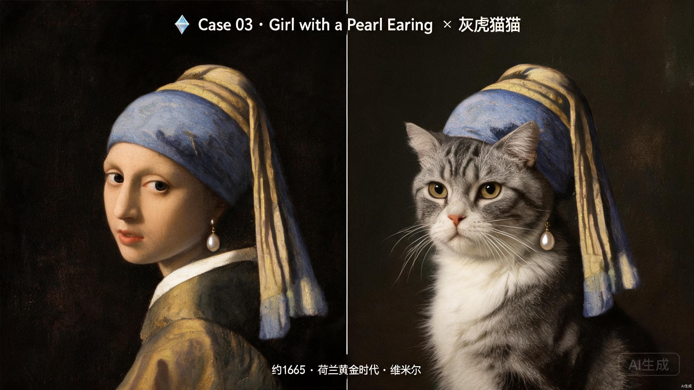

# 你的毛孩子也能成为传世名画的主角？这个 AI 神器我只偷偷告诉你！🐱🎨

---



> "每只毛孩子都是天生的艺术家。" ——我们只是帮 TA 找到了最合适的画布。

---

## 🌠 你有没有想过……

如果你的猫主子走进了梵高的《星月夜》，和漩涡星空一起眨眼睛？
如果你的狗主子坐在委拉斯开兹的《宫娥》中央，被宫女群臣环绕？
如果你的兔子戴上了维米尔的珍珠耳环，回眸一笑惊艳四座？

今天要给大家介绍的，就是一个能把这些脑洞**变成现实**的 AI 神器——

# 🎨 Art is everywhere · 行走的艺术

> 名画中的萌宠，行走的艺术。将您的爱宠融入跨越五百年的艺术史，让每一只毛孩子都成为传世名作的主角。

这是一个开源的 AI Skill（技能包），可以在 **Trae / Kimi Work / Codex / Claude** 等平台运行。只要上传一张宠物照片，就能生成**"原画 vs 萌宠成图"左右对比图**，配上准确的名画信息——博物馆级别的体验，30 秒搞定！

---

## ✨ 三大核心玩法，一次看个够

### 玩法 1：🎲 随机生成 ——交给命运，每次都是惊喜

不知道选哪幅？没关系！

系统内置 **100 幅经典名画库**，覆盖从文艺复兴到当代的 **16 大艺术流派**。根据你家毛孩子的类型（猫/狗/兔/鸟），智能匹配最适合的名画，加权随机：

- **70%** 高匹配度 TOP 10
- **20%** 同风格探索
- **10%** 惊喜盲盒（万一你家猫天生就是《格尔尼卡》气质呢？）

### 玩法 2：🎨 自选名画 ——100 幅任你挑，选择困难慎点！

喜欢掌控全局？直接浏览 16 大风格：

| 流派 | 代表作品 |
|------|---------|
| 🎨 文艺复兴 | 蒙娜丽莎、创造亚当、春、维纳斯的诞生 |
| 🏛️ 巴洛克 | 宫娥、夜巡、戴珍珠耳环的少女 |
| 🌅 印象派 | 星月夜、睡莲、日出·印象、向日葵 |
| 🖼️ 现代艺术 | 两个弗里达、格尔尼卡、梦、记忆的永恒 |
| 🎴 东方艺术 | 千里江山图、神奈川冲浪里、清明上河图 |
| 🏮 中国艺术 | 溪山行旅图、韩熙载夜宴图、五牛图 |
| 还有 10 个流派… | 共 100 幅，太多了写不下！ |

> 💡 偷偷说：**猫咪 TOP 5** 推荐 ——宫娥 / 两个弗里达 / 埃尔·格列柯肖像 / 胖男孩抱宠物 / 戴珍珠耳环的少女

### 玩法 3：📥 一键下载 ——高清 PNG，发朋友圈/壁纸/打印都行

对比图（2400×1900 高清）+ 单独成图，两种格式任你选：
- 对比图：左边原画参考 · 右边萌宠合成 · 底部信息标签
- 单独成图：纯净版，方便做壁纸或定制周边

---

## 🌟 三个真实案例，看完你也想试试！

---

### 🎯 案例 01：《宫娥》× 灰虎斑加白猫
> 17 世纪西班牙宫廷 · 小公主变身喵星人



| 信息 | 详情 |
|------|------|
| 🎨 画作 | 《宫娥》 *Las Meninas* |
| 👤 作者 | 迭戈·罗德里格斯·德·席尔瓦·委拉斯开兹（Diego Velázquez）|
| 📅 创作时间 | 1656 年 |
| 🎭 流派 | 西班牙巴洛克绘画（黄金时代）|
| 📍 现藏地点 | 西班牙马德里 · 普拉多国家博物馆 |
| 📐 原作尺寸 | 318 × 276 cm |
| 🐱 融合说明 | 灰虎斑加白猫替换小公主玛格丽特·特蕾莎，端坐宫廷中央，两侧宫女服侍；左侧为委拉斯开兹自画像（胸口红十字勋章）；后墙镜中反射国王夫妇——**所有标志性元素一个都没少**！ |

---

### 🎯 案例 02：《星月夜》× 灰虎斑加白猫
> 梵高的旋涡星空 · 猫咪坐在山坡仰望星河



| 信息 | 详情 |
|------|------|
| 🎨 画作 | 《星月夜》 *The Starry Night* |
| 👤 作者 | 文森特·威廉·梵高（Vincent Willem van Gogh）|
| 📅 创作时间 | 1889 年 6 月 |
| 🎭 流派 | 后印象派 |
| 📍 现藏地点 | 美国纽约 · 现代艺术博物馆 |
| 📐 原作尺寸 | 73.7 × 92.1 cm |
| 🐱 融合说明 | 灰虎斑加白猫坐在前景山坡上，仰头凝望旋涡星空，**取代了原画左侧的柏树位置**。猫毛的虎斑条纹以梵高式厚涂笔触绘制，与旋涡天空的节奏融为一体——**笔触一致，无缝融合**！ |

---

### 🎯 案例 03：《戴珍珠耳环的少女》× 灰虎斑加白猫
> 荷兰黄金时代 · 猫咪化身"北方蒙娜丽莎"



| 信息 | 详情 |
|------|------|
| 🎨 画作 | 《戴珍珠耳环的少女》 *Girl with a Pearl Earring* |
| 👤 作者 | 约翰内斯·维米尔（Johannes Vermeer）|
| 📅 创作时间 | 约 1665 年 |
| 🎭 流派 | 荷兰黄金时代（Tronie 风格肖像）|
| 📍 现藏地点 | 荷兰海牙 · 莫瑞泰斯皇家美术馆 |
| 📐 原作尺寸 | 44.5 × 39 cm |
| 🐱 融合说明 | 灰虎斑加白猫以四分之三侧面回头凝视观众，**完美复刻原画少女的姿态**。猫咪头戴蓝金色迷你头巾，左耳悬挂标志性的水滴形珍珠耳环——那光泽，那回眸，维米尔本米尔！ |

---

## 🔬 细节控福音：我们对质量有多苛刻？

### 5 条硬性红线，一条不过关就重画！

1. ❌ **禁止畸形**：多只眼、少只腿、面部扭曲——直接销毁重画
2. ❌ **不丢标志性元素**：《宫娥》的红十字勋章、《星月夜》的教堂尖塔、《珍珠耳环》的珍珠——一个都不能少
3. ❌ **不许剪切感**：宠物边缘不能有"白色描边"或"抠图感"，必须无缝融入
4. ❌ **拒绝恐怖谷**：人物/动物面部绝不能变成怪异融合脸
5. ❌ **内容合规**：任何低俗、血腥、冒犯性元素直接过滤

### 5 条软性优选，追求极致

- ✅ **特征相似度**：保留你家毛孩子的面部特征
- ✅ **笔触一致性**：与原画质感接近
- ✅ **色彩还原度**：不偏色、不发灰
- ✅ **构图稳定**：宠物是视觉焦点但不突兀
- ✅ **细节层次**：不糊弄，经得起放大

> 最多自动迭代 2 次，还不满意？直接告诉 AI 调整方向，比如"猫再大一点""色彩再暖一点"。

---

## 🚀 怎么用？三种方式，任君选择

### 方式一：Trae Skill（最推荐，原生支持）
```bash
cp -r xing-zou-de-yi-shu/ .trae/skills/
```
上传宠物照片 → 自动激活 → 选择 [随机生成] 或 [选择名画] → 等待 30 秒 → 收下惊喜！

### 方式二：系统提示词（Kimi / Claude / Codex 通用）
1. 复制 `SKILL.md` 内容到系统提示词 / Custom Instructions
2. 确保 `resources/` 和 `scripts/` 在可访问路径
3. 上传宠物照片，AI 按指令执行

### 方式三：独立脚本（纯技术党）
```bash
pip install Pillow
python3 scripts/compose_comparison.py \
  original.png pet_fusion.png comparison_output.png \
  '{"title_zh":"宫娥","title_original":"Las Meninas",...}'
```

---

## 🌍 跨平台兼容一览表

| 平台 | 状态 | 部署方式 |
|------|------|---------|
| **Trae** | ✅ 完全兼容 | 放入 `.trae/skills/` 目录 |
| **Kimi Work** | ✅ 兼容 | SKILL.md 作为系统提示词 |
| **Codex (OpenAI)** | ✅ 兼容 | SKILL.md 作为 custom instructions |
| **Claude** | ✅ 兼容 | SKILL.md 作为 system prompt |
| **通用 AI Agent** | ✅ 兼容 | 标准 Markdown 指令格式 |

---

## 🎁 彩蛋：宠物适配速查表

| 宠物 | TOP 5 推荐 | 风格建议 |
|------|-----------|---------|
| 🐱 猫咪 | 宫娥 · 两个弗里达 · 格列柯肖像 · 胖男孩 · 珍珠耳环 | 肖像类、宫廷类、神秘气质 |
| 🐕 狗狗 | 夜巡 · 大碗岛 · 星月夜 · 睡莲 · 呐喊 | 群像类、户外类、活力动感 |
| 🐇 兔/小宠 | 春 · 向日葵 · 睡莲 · 珍珠耳环 · 蒙娜丽莎 | 柔焦花卉、甜美肖像 |
| 🦜 鸟类 | 星月夜 · 神奈川冲浪 · 富春山居 · 凯风快晴 · 春 | 山水风景、自然意境 |

---

## 💬 写在最后

我们做这个项目的初衷很简单：

> 艺术不该只挂在美术馆墙上，也不该只属于人类。
> 每一只毛孩子都有属于自己的"名作时刻"——
> 可能是慵懒如《蒙娜丽莎》的微笑，
> 可能是灵动如《星月夜》的眼神，
> 也可能是高贵如《宫娥》的气质。

**Art is everywhere**，爱也一样。

---

### 🌟 GitHub 仓库（欢迎 Star ⭐ & Fork）
**https://github.com/serenashenn3-art/Art-is-everywhere**

> MIT License · 完全开源 · 100 幅名画库 · 中英双语文档
> v3.0 · 2026.08 · 行走的艺术团队

---

**下期预告**：我们正在测试 **多宠物同框** + **名画风格迁移做定制周边**（手机壳/抱枕/装饰画）功能，关注我们，第一时间获取更新！

🐱 你家毛孩子最适合哪幅名画？评论区晒图，我们帮你选！🎨

---

**📷 配图清单（本文内 5 张）：**
1. `assets/promo-banner-cover.jpg` ——首图横幅（16:9）
2. `assets/case-las-meninas-share.jpg` ——案例 1：宫娥
3. `assets/case-starry-night-share.jpg` ——案例 2：星月夜
4. `assets/case-pearl-earring-share.jpg` ——案例 3：戴珍珠耳环的少女
5. `assets/promo-social-vertical.jpg` ——文末竖版推广图（可选）
